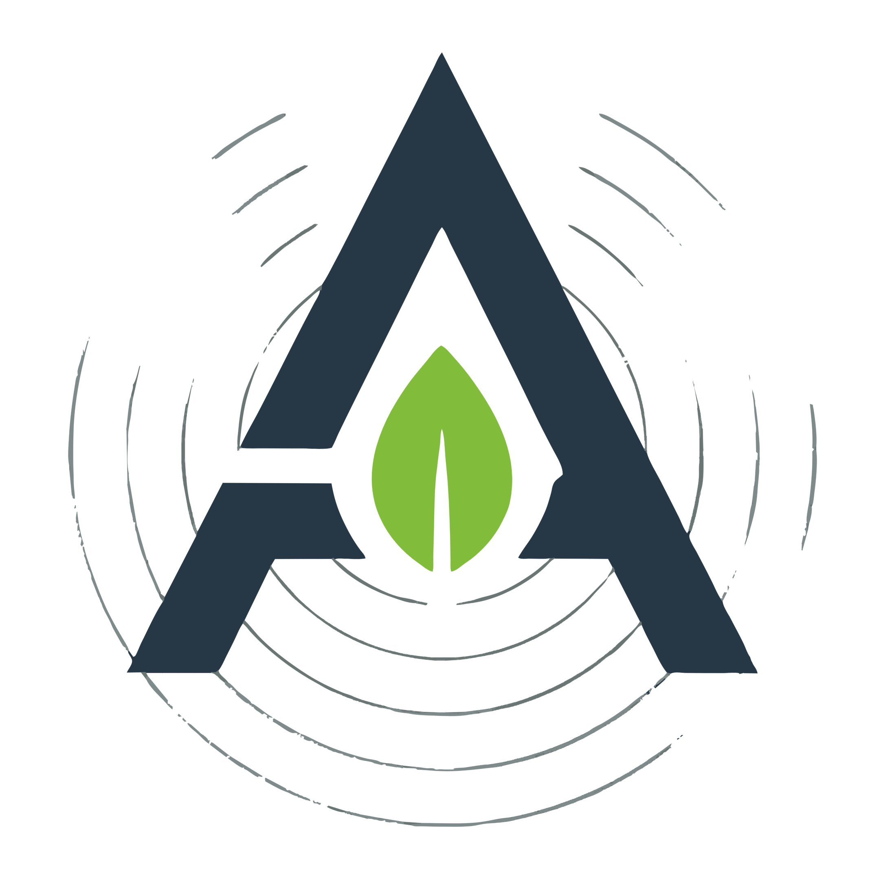

<p align="center">
  
</p>

<p align="center">
  <strong>Asase — Global Earth Intelligence & Multi-Hazard Planetary Defense Platform</strong>
</p>

<p align="center">
  <a href="https://play.google.com/store/apps/details?id=ng.kiri.asase"></a>
  <a href="#download"></a>
  <a href="#download"></a>
  <a href="#download"></a>
  
  
</p>

---

## 📥 Download

| Platform | Package | Description |
| :---: | :---: | :--- |
| 🤖 **Android** | [](https://play.google.com/store/apps/details?id=ng.kiri.asase) | Recommended for Android mobile and tablet devices |
| 🪟 **Windows** | [](https://github.com/Nwokike/Asase/releases/latest/download/Asase.exe) | Standalone desktop installer with taskbar & shortcut integration |
| 🐧 **Linux (Debian/Ubuntu)** | [](https://github.com/Nwokike/Asase/releases/latest/download/Asase.deb) | Native desktop package for Ubuntu, Debian, Linux Mint & Pop!_OS |
| 🎩 **Linux (Fedora/RHEL)** | [](https://github.com/Nwokike/Asase/releases/latest/download/Asase.rpm) | Native package for Fedora, openSUSE, RHEL & CentOS |
| 📦 **Linux (Portable)** | [](https://github.com/Nwokike/Asase/releases/latest/download/Asase.tar.gz) | Standalone portable archive for Arch, Alpine, Steam Deck & all distros |

### Android Architecture Build Splits

| Variant | Download | Device Compatibility |
| :--- | :---: | :--- |
| 📱 **ARM64** (v8a) | [**asase-arm64-v8a.apk**](https://github.com/Nwokike/Asase/releases/latest/download/asase-arm64-v8a.apk) | Modern 64-bit Android smartphones & tablets |
| 📱 **ARMv7** (32-bit) | [**asase-armeabi-v7a.apk**](https://github.com/Nwokike/Asase/releases/latest/download/asase-armeabi-v7a.apk) | Legacy 32-bit Android devices |
| 💻 **x86_64** (Emulators) | [**asase-x86_64.apk**](https://github.com/Nwokike/Asase/releases/latest/download/asase-x86_64.apk) | ChromeOS, Chromebooks & Android desktop emulators |

---

## 🌍 Core Capabilities

| Capability | Telemetry Source | Description |
| :--- | :---: | :--- |
| **Seismic Hazards** | USGS FDSN | Real-time global earthquake feeds with Richter magnitude, depth, tsunami warnings, and geodesic shockwave radius. |
| **Space Weather & $K_p$** | NOAA SWPC | Planetary $K_p$-index geomagnetic disturbance monitor with 12-reading live progression curves. |
| **Solar Radiation** | NOAA GOES Primary | Real-time satellite solar X-ray flux and flare classification (A, B, C, M, X class). |
| **Atmospheric & Storms** | Open-Meteo Forecast | Hyperlocal temperature, surface pressure, extreme wind gusts, UV index, and CAPE thunderstorm potential. |
| **Air Quality Spectrum** | Open-Meteo AQI | European AQI, US AQI, $\text{PM}_{2.5}$, $\text{PM}_{10}$, Carbon Monoxide ($\text{CO}$), Ozone ($\text{O}_3$), $\text{NO}_2$, $\text{SO}_2$, and Saharan dust. |
| **GloFAS Hydrology** | Copernicus / GloFAS | Global river discharge forecasting ($m^3/s$) and 7-day hydrological flood progression. |
| **Marine Swell Dynamics** | Open-Meteo Marine | Ocean wave height, period, direction, and coastal swell surge risks. |
| **Planetary Disasters** | NASA EONET v3 | Satellite thermal anomaly tracking for active wildfires, severe storms, volcanoes, and sea ice. |

---

## ✨ Features

- **100% Free & Auth-Free** — Zero API keys required. Direct client connections to official open public domain planetary telemetry endpoints.
- **Watermark-Free Esri Dark Gray Map** — Auth-free Esri Dark Gray Canvas tiles with OpenStreetMap fallback and interactive shockwave circles.
- **Segmented Theme Mode Switcher** — Instant switching between **Light** ☀️, **Dark** 🌙, and **System** 🖥️ modes matching DDGS & Sherlock UX.
- **Hardware-Accelerated Charts** — Live geomagnetic curves and multi-axis planetary threat radar charts with `flet-charts`.
- **Proximity Geodesic Engine** — Haversine distance engine warning users of nearest active hazards (e.g. *"142 km from you"*).
- **Offline Telemetry Caching** — L1 LRU Memory + L2 Gzip Disk caching (`.json.gz`) with atomic swaps and corruption recovery.
- **Live Activity Terminal** — Real-time event and connection logging with one-tap clipboard copy and diagnostic inspection.
- **Native Sharing & Links** — 1-tap report sharing via `ft.Share` and official agency deep linking via `ft.UrlLauncher`.
- **Monetization & Privacy** — Responsive Google AdMob banners and interstitial ads with consent management.

---

## 🛠️ Development & Testing

```bash
# Install dependencies with uv
uv sync --dev

# Run linter & formatter checks
uv run ruff check . --fix
uv run ruff format .

# Run comprehensive test suite (50 tests)
uv run pytest -v

# Start local desktop development server
uv run flet run
```

---

## 🧭 License

MIT License © 2026 Kiri Research Labs. All planetary telemetry sourced from open public-domain science organizations (USGS, NOAA, NASA, Copernicus & Open-Meteo).
