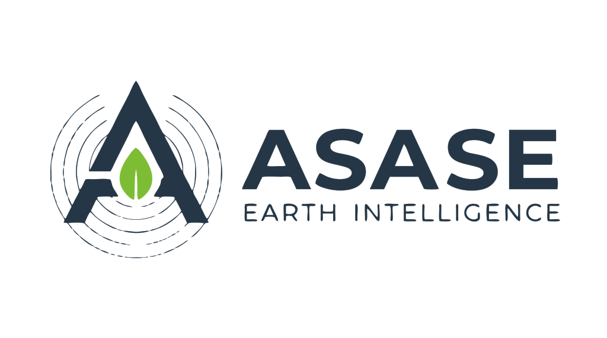
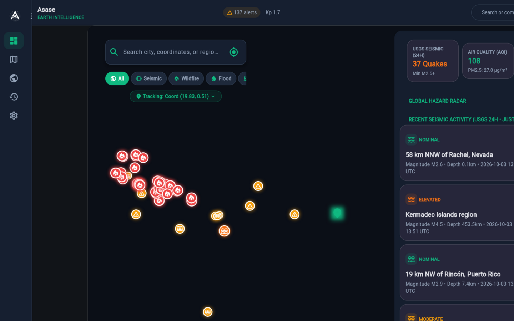
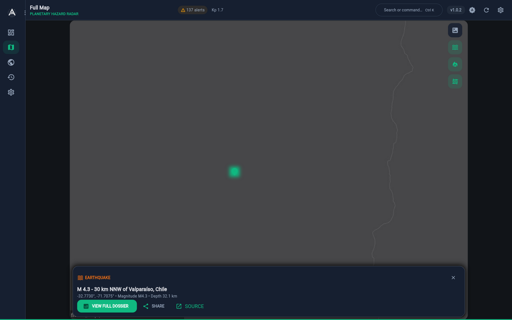
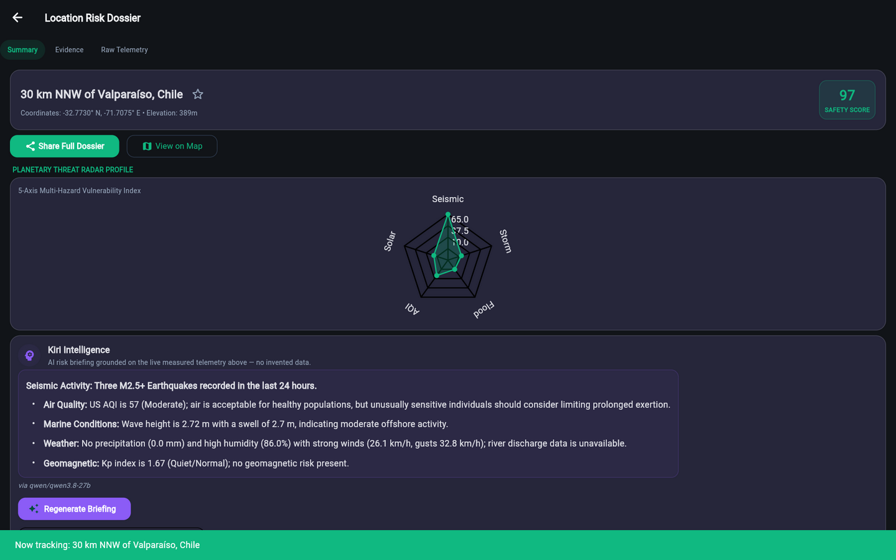
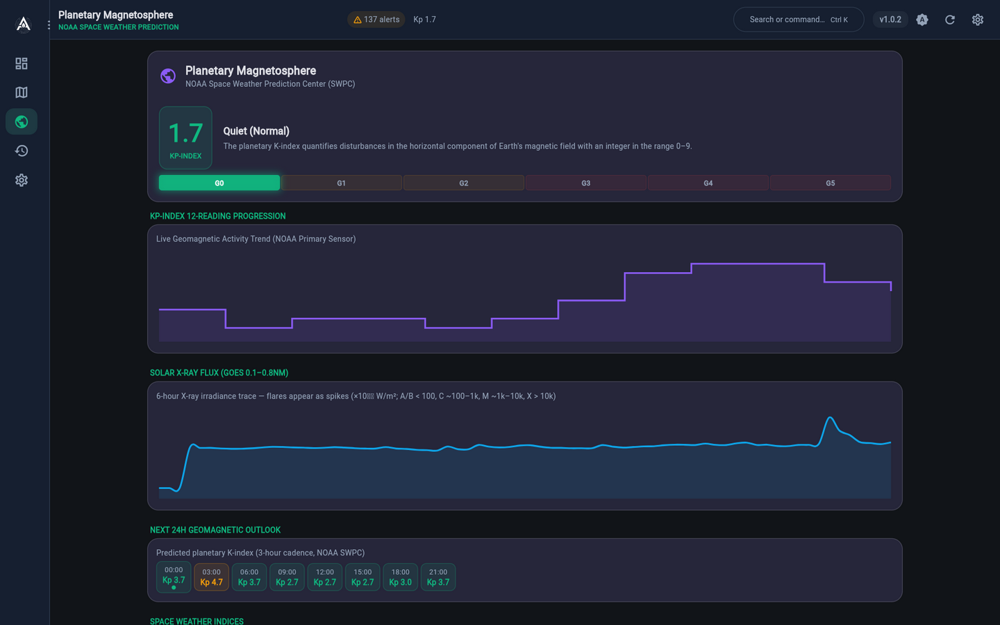
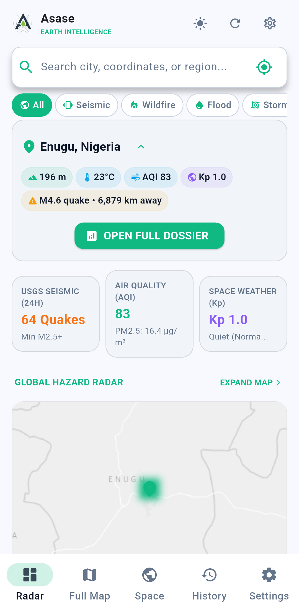
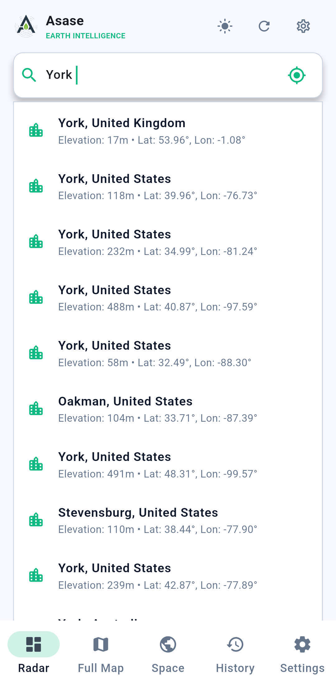
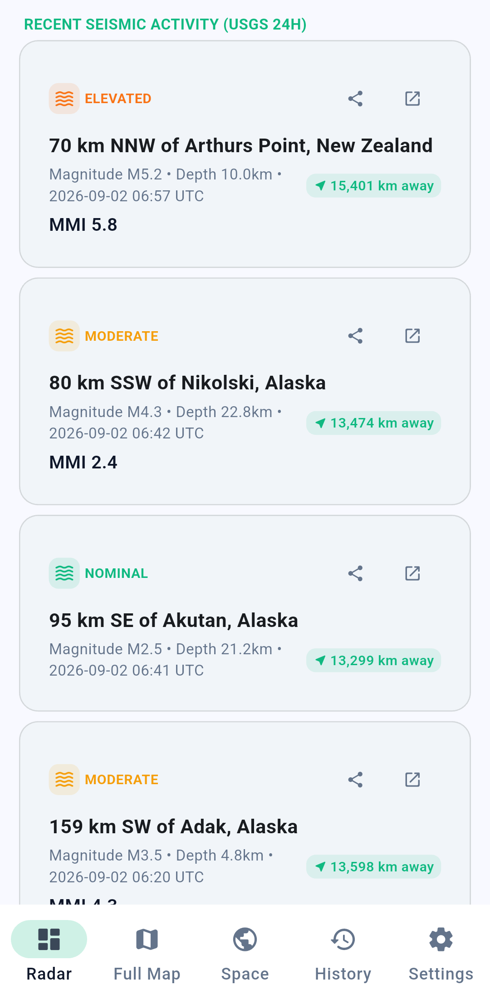
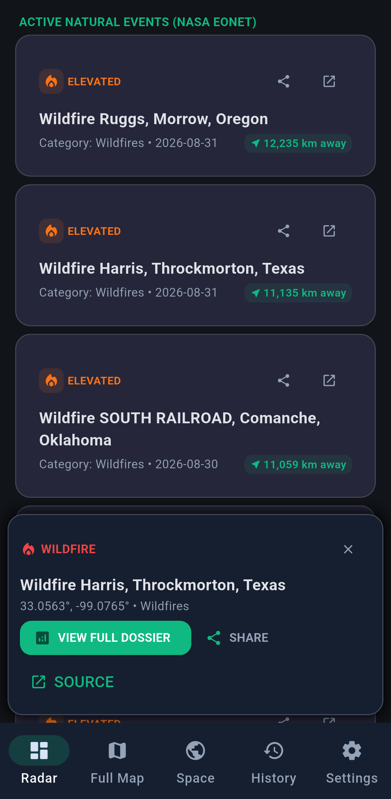

<p align="center">
  
</p>

<p align="center">
  <strong>Global Earth Intelligence & Multi-Hazard Planetary Defense Platform</strong>
</p>

<p align="center">
  <a href="https://asase.kiri.ng"></a>
  <a href="https://play.google.com/store/apps/details?id=ng.kiri.asase"></a>
  <a href="#download"></a>
  <a href="#download"></a>
  <a href="#download"></a>
  
  
</p>

---

## 📥 Download

| Platform | Package | Description |
| :---: | :---: | :--- |
| 🌐 **Web App** | [](https://asase.kiri.ng) | Live progressive web application running directly in your browser |
| 🤖 **Android** | [](https://play.google.com/store/apps/details?id=ng.kiri.asase) | Recommended for Android mobile and tablet devices |
| 🪟 **Windows** | [](https://github.com/Nwokike/Asase/releases/latest/download/Asase_Setup.exe) | Standalone Inno Setup installer with taskbar & desktop integration |
| 🐧 **Linux (Debian/Ubuntu)** | [](https://github.com/Nwokike/Asase/releases/latest/download/Asase_amd64.deb) | Native desktop package for Ubuntu, Debian, Linux Mint & Pop!_OS |
| 🎩 **Linux (Fedora/RHEL)** | [](https://github.com/Nwokike/Asase/releases/latest/download/Asase_x86_64.rpm) | Native package for Fedora, openSUSE, RHEL & CentOS |
| 📦 **Linux (Universal)** | [](https://github.com/Nwokike/Asase/releases/latest/download/Asase_linux_x86_64.tar.gz) | Standalone portable archive for Arch, Alpine, Steam Deck & all distros |

### Android Architecture Build Splits

| Variant | Download | Device Compatibility |
| :--- | :---: | :--- |
| 📱 **ARM64** (v8a) | [**asase-arm64-v8a.apk**](https://github.com/Nwokike/Asase/releases/latest/download/asase-arm64-v8a.apk) | Modern 64-bit Android smartphones & tablets |
| 📱 **ARMv7** (32-bit) | [**asase-armeabi-v7a.apk**](https://github.com/Nwokike/Asase/releases/latest/download/asase-armeabi-v7a.apk) | Legacy 32-bit Android devices |
| 💻 **x86_64** (Emulators) | [**asase-x86_64.apk**](https://github.com/Nwokike/Asase/releases/latest/download/asase-x86_64.apk) | ChromeOS, Chromebooks & Android desktop emulators |

---

## 🌍 Core Capabilities

| Capability | Telemetry Source | Description |
| :--- | :---: | :--- |
| **Seismic Hazards** | USGS FDSN | Real-time global earthquake feeds with Richter magnitude, depth, tsunami warnings, and geodesic shockwave radius. |
| **Space Weather & $K_p$** | NOAA SWPC | Planetary $K_p$-index geomagnetic disturbance monitor with 12-reading live progression curves. |
| **Solar Radiation** | NOAA GOES Primary | Real-time satellite solar X-ray flux and flare classification (A, B, C, M, X class). |
| **Atmospheric & Storms** | Open-Meteo Forecast | Hyperlocal temperature, surface pressure, extreme wind gusts, UV index, and CAPE thunderstorm potential. |
| **Air Quality Spectrum** | Open-Meteo AQI | European AQI, US AQI, $\text{PM}_{2.5}$, $\text{PM}_{10}$, Carbon Monoxide ($\text{CO}$), Ozone ($\text{O}_3$), $\text{NO}_2$, $\text{SO}_2$, and Saharan dust. |
| **GloFAS Hydrology** | Copernicus / GloFAS | Global river discharge forecasting ($m^3/s$) and 7-day hydrological flood progression. |
| **Marine Swell Dynamics** | Open-Meteo Marine | Ocean wave height, period, direction, and coastal swell surge risks. |
| **Planetary Disasters** | NASA EONET v3 | Satellite thermal anomaly tracking for active wildfires, severe storms, volcanoes, and sea ice. |

---

## 📸 Screenshots

### Radar Dashboard (desktop, dark)

<p align="center">
  
</p>
<p align="center"><em>Web-first canvas — collapsible sidebar, live status bar with alerts & Kp, floating search rail, and scrollable telemetry feed over a full-bleed hazard map</em></p>

### Global Hazard Map (desktop, dark)

<p align="center">
  
</p>
<p align="center"><em>Full-bleed map with right-edge layer toggles, threat mini-strip ("92 critical nearby"), selected-event sheet with one-tap full dossier</em></p>

### Location Risk Dossier (desktop, dark)

<p align="center">
  
</p>
<p align="center"><em>Summary / Evidence / Raw Telemetry tabs — safety score hero, 5-axis threat radar, and the grounded Kiri Intelligence AI briefing</em></p>

### Space Weather (desktop, dark)

<p align="center">
  
</p>
<p align="center"><em>NOAA Kp-index hero with glowing G-scale meter, 12-reading progression chart, GOES X-ray flux trace, and severity-tinted 24h forecast chips</em></p>

### Mobile (light & dark)

<table>
  <tr>
    <td width="50%"></td>
    <td width="50%"></td>
  </tr>
  <tr>
    <td align="center"><em>Mobile dashboard — bottom navigation, filter chips, quick metrics</em></td>
    <td align="center"><em>Typeahead geocoding with live elevation and lat/lon</em></td>
  </tr>
  <tr>
    <td width="50%"></td>
    <td width="50%"></td>
  </tr>
  <tr>
    <td align="center"><em>USGS 24h feed — magnitude, depth, severity badges, distance chips</em></td>
    <td align="center"><em>Tap a wildfire to expand inline — perimeter polygon, dossier, share</em></td>
  </tr>
</table>

---

## ✨ Features

- **100% Free & Auth-Free** — Zero API keys required. Direct client connections to official open public domain planetary telemetry endpoints.
- **Watermark-Free Esri Map** — Auth-free Esri Canvas Dark/Light + World Imagery satellite tiles with interactive shockwave circles and wildfire perimeter polygons.
- **Instant Reactive Theme Mode Switcher** — Real-time switching between **Light** ☀️, **Dark** 🌙, and **System** 🖥️ modes across all screens with transparent vector branding.
- **Hardware-Accelerated Charts** — Live geomagnetic curves, multi-axis planetary threat radar, and a 7-pollutant AQI comparison chart with `flet-charts`.
- **Proximity Geodesic Engine** — Haversine distance engine warning users of nearest active hazards (e.g. *"142 km from you"*).
- **Offline Telemetry Caching** — L1 LRU Memory + L2 MsgPack Disk caching with atomic swaps, corruption recovery, and ETag/Last-Modified conditional refresh (304 skips re-download).
- **Live Activity Terminal** — Real-time event and connection logging with one-tap clipboard copy and diagnostic inspection.
- **Native Sharing & Links** — 1-tap report sharing via `ft.Share` and official agency deep linking via `ft.UrlLauncher`.
- **Monetization & Privacy** — Responsive Google AdMob banners and interstitial ads with consent management.
- **Unit Preferences** — Temperature (°C/°F) and wind speed (km/h/mph) follow your Settings across the banner, weather card, and exported dossier.

---

## 🛠️ Development & Testing

```bash
# Install dependencies with uv
uv sync --dev

# Run linter & formatter checks
uv run ruff check . --fix
uv run ruff format .

# Run comprehensive test suite (300+ tests)
uv run pytest -v

# Start local desktop development server
uv run flet run
```

---

## 🧭 License

MIT License © 2026 Kiri Research Labs. All planetary telemetry sourced from open public-domain science organizations (USGS, NOAA, NASA, Copernicus & Open-Meteo).
